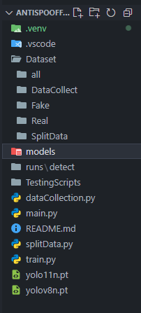

This project requires a whole bunch of dependencies
1. You need to Install Visual Studio 2022 - Community edition (free) "In the setup phase, you'll only need the Desktop Development with C++ Package"
  In order for the program to run smoother and faster:
  1. uninstall torch, torchvideo, torchaudio
  2. go to https://pytorch.org/get-started/locally/
  3. setup according to your system specifications and then copy the "run this command"
2. Install all of the packages required (cvzone, ultralytics, mediapy)

How to operate:
1. Run dataCollection.py with the real faces (classID=1)
2. Cut from Dataset/DataCollect to Dataset/Real (ctrl + x)
3. Run dataCollection.py again with fake faces and faces on your phone or television (classID=0)
4. Cut from Dataset/DataCollect to Dataset/Fake (ctrl + x)
5. Copy the same amount of files from Dataset/Real and Dataset/Fake to Dataset/all (copy all the files ".txt and .jpg")
6. Run splitData.py, if it results in ERROR, create a SplitData folder inside of Dataset folder
7. If everything goes to plan, inside of SplitData there will be a data.yaml
8. Change data.yaml path to the current directory (ex: C:\Users\Desktop\Work\antispooffacerecognition\Dataset\SplitData)
9. Run train.py. If it doesn't work, you didn't change the data.yaml directory correctly
10. Once train.py is done running, go to runs/train(lasttrain)/weights/best.py and copy best.pt to a new folder called models
11. rename it to whatever you want (ex: n_version1.pt)
12. Go to main.py and change model to that path (ex: model = YOLO("../models/n_version2.pt"))
13. If main.py doesn't run, try  changing the value '0' in cap = cv2.VideoCapture(0) to 1, 2 or 3
14. If you've followed every step, your program should detect real and fake faces

folder structure should look like this (except "TestingScripts" folder)
You may run into problems if "Dataset" isn't structured exactly as shown in the picture

<video controls src="demo_01.mp4" title="Title"></video>